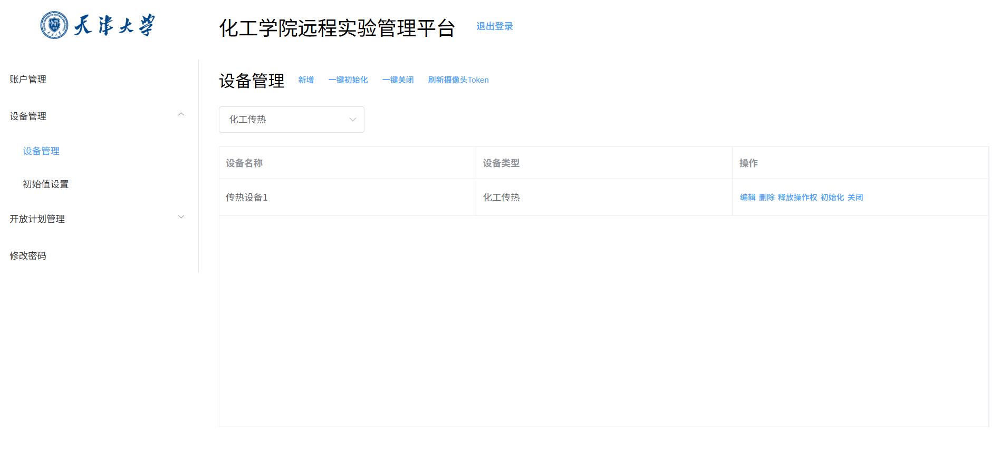

# 化工远程虚拟实验平台

### 项目介绍

- 项目名称：远程虚拟实验平台（前端部分）
- 项目简介：本项目是为化工学院搭建的一个远程虚拟实验平台。该平台主要用于学生远程操纵化工学院的实验设备，开展线上虚拟实验。学生和教师还可以使用该平台预约实验时间。此外，该平台还具备设备管理、实验打分等功能。
- 项目使用的技术栈：
  - 数据库：MySQL
  - 后端：SpringBoot + Spring MVC + Spring Data JPA + LOMBOK（Java8）
  - 前端：Vue.js2.0 + ElementUI
- 项目部署与维护情况：
  - 该项目部署在天大内网中，于2023年上线
  - 该项目最后一次维护于2024年8月（由原2024届学生维护）
- 项目成员：项目由天津大学智能与计算学部李罡老师负责，以及两名2024届学生共同进行开发。本人负责前端部分的所有工作，李罡老师和另一名同学负责后端工作。李罡老师还负责项目部署和与化工学院对接的工作
- 后端仓库地址：https://gitee.com/tjucs/chemlab_backend.git

### 项目结构

项目结构如图所示，共分为三层：

- 用户层：用户通过客户端或管理端进行操作，读写数据、控制实验设备。
- 服务层：部署在服务器上的后端应用程序接收和响应用户层发送的数据请求，与数据库进行数据交换。用户的控制指令以数据的形式存储在数据库中，服务层无法直接操作实验设备。
- 设备层：实验设备通过读取数据库执行对应指令。


### 前端基本功能与效果图

- 客户端（client）：供学生和教师使用

  - 预约：查看实验设备的预约状态，预约实验时间

    

  - 实验：在预约时间内进入对应的实验房间，操作设备进行实验。各类数据和交互在示意图上显示，摄像头显示设备实时情况。同一时刻只能有一人进行操作，所有操作会被记录到实验记录中。

    

- 管理端（admin）：供实验室管理员使用，主要功能包括：

  - 设备管理：维护实验设备信息，设定实验设备的初始参数，拥有控制实验设备的最高权限

    

  - 开放计划管理：制订实验设备的开放计划，批量管理实验设备的开放时段，查看实验设备的开放情况和预约情况

    设置日开放计划：

    

    批量管理设备开放时间：

    

    查看设备开放情况：

    

    查看预约情况：

    		

  - 账户管理：维护账户信息

    

### 项目使用方法

- 后端部署：（Java8）

```
git clone https://gitee.com/tjucs/chemlab_backend.git
cd chemlab_backend
./mvnw spring-boot:run
```

- 前端部署：（Vue.js 2.0）

  ```
  git clone https://github.com/PathfinderTJU/Chem_lab.git
  ```

  - 管理端：（测试账号：admin，密码：123456）

  ```
  cd chemistry-admin
  npm run start
  ```

  - 客户端：（学生测试账号：stu01，密码：123456；教师测试账号：tea01，密码：123456）

  ```
  cd chemistry-client
  npm run start
  ```
